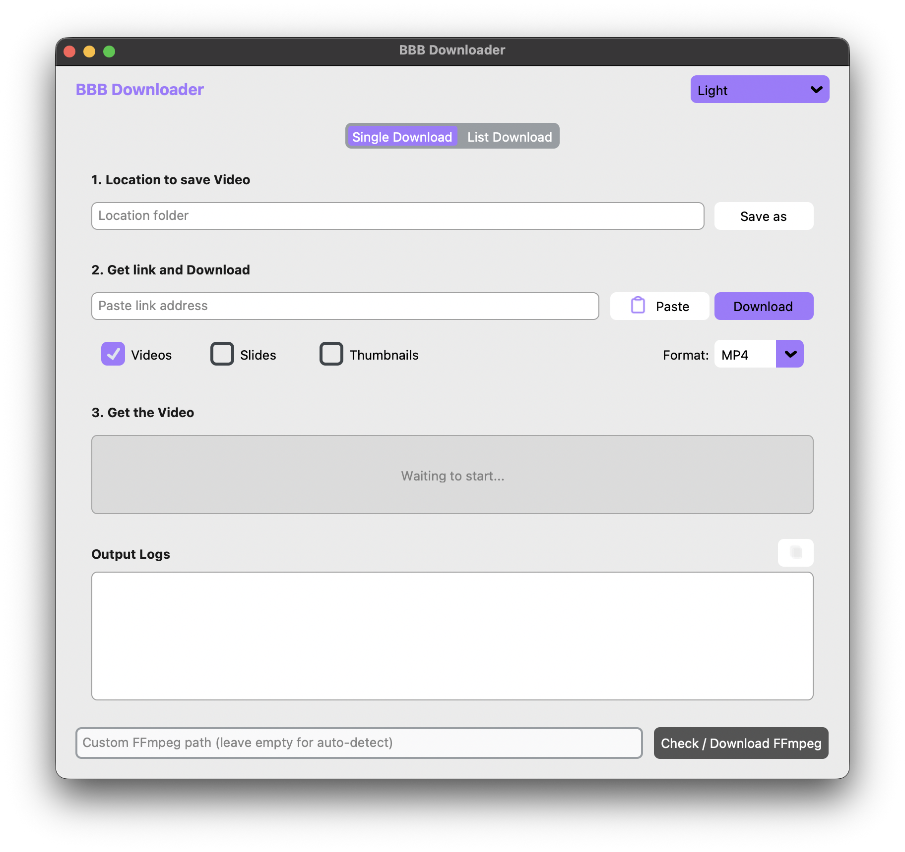
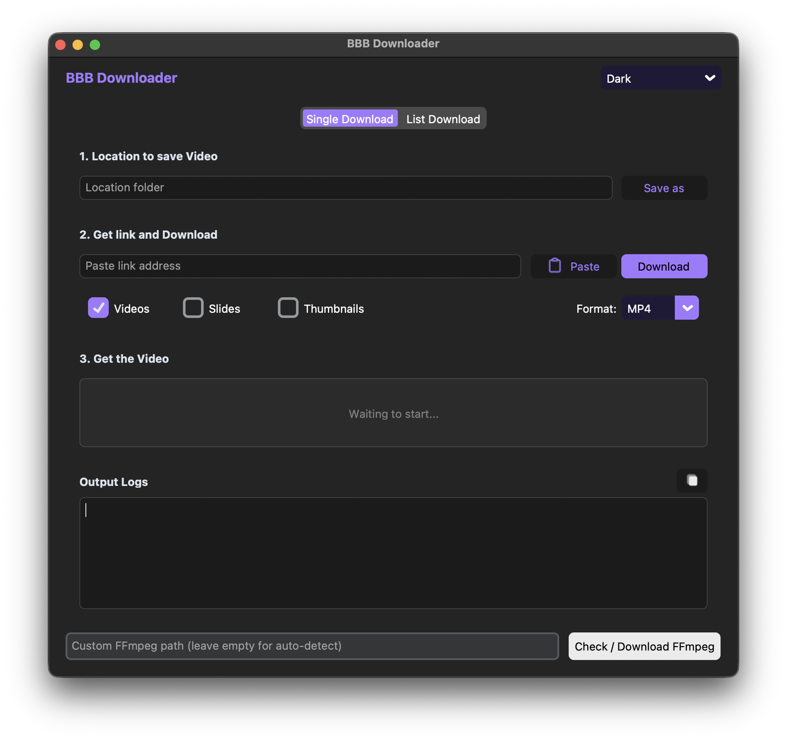

<div align="center">


# BBB Downloader GUI

A desktop GUI built with [CustomTkinter](https://github.com/TomSchimansky/CustomTkinter) that wraps the [bbb-downloader](https://github.com/trahay/bbb-downloader) scripts — download and merge BBB recordings without a terminal.

</div>

---

## Downloads

Pre-built binaries are available on the [Releases page](https://github.com/XDMustafa/bbb-downloader-GUI/releases).

| Platform | Status | Download |
|:---:|:---:|:---:|
| 🍎 **macOS** (Apple Silicon, `.app`) | ✅ Available | [v1.0.0](https://github.com/XDMustafa/bbb-downloader-GUI/releases/tag/v1.0.0) |
| 🪟 **Windows** (`.exe`) | 🚧 Coming soon | — |

> **macOS note:** On first launch you may see *"BBB Downloader cannot be opened because the developer cannot be verified."* Right-click the app → **Open** → **Open anyway**. This is expected for unsigned apps.

---

## Features

- **Single Download tab** — paste one BBB URL and go
- **List Download tab** — batch process multiple URLs (one per line)
- **Stream toggles** — webcam, deskshare, slides; turn off what you don't need
- **Format options**
  - Default `‑c copy` (fast, lossless, seconds)
  - Optional **Full Compatibility** re-encode (libx264 + AAC) for iOS / older players
  - Optional **Keep raw files** for intermediate `.webm` inspection
- **Paste-from-clipboard** button — no manual copy/paste
- Remembers your last save folder
- Auto-detects light/dark mode
- **Built-in FFmpeg downloader** — no manual PATH setup needed

<div align="center">

&nbsp;


</div>

> Webcam-only recordings (no deskshare) are handled: the webcam video is used as the primary stream and its embedded audio track is preserved.

---

## Quick Start (run from source)

**Step 1 — get the files**

- **Zip download** (no terminal): click the green **Code** button at the top of this page → **Download ZIP**. Unzip anywhere you like.
- **git clone** (terminal): `git clone https://github.com/XDMustafa/bbb-downloader-GUI`

**Step 2 — install Python** (one-time)

Download Python 3.8+ from [python.org](https://www.python.org/downloads/). During install **tick "Add Python to PATH"**.

**Step 3 — install dependencies** (one command)

Open a terminal inside the extracted folder:

```bash
pip install -r python-requirements.txt
```

**Step 4 — launch**

```bash
python main.py
```

> **FFmpeg:** if `ffmpeg` is already in your PATH (macOS Homebrew users typically have it), the app picks it up automatically. If not, use the built-in **Check / Download FFmpeg** button — no manual download needed.

---

## Project Structure

```
main.py                  – entry point: `python main.py`
bbb_gui.py               – UI layer (themes, tabs, paste button, layout)
bbb_core.py              – download thread, URL parsing, ffmpeg merge & cleanup
ffmpeg_tools.py          – ffmpeg detection / download helper / ffprobe wrapper
script/                  – patched upstream CLI scripts (bbb.py adds URL variants)
python-requirements.txt  – customtkinter, pillow, pyperclip (additive)
gui-assets/
  ├── images/            – Banner.jpg, Light-Theme.png, Dark-Theme.png
  └── icons/             – BBBDownloader.icns (macOS), icon.ico (Windows), button icons
BBB Downloader.spec       – PyInstaller spec (macOS .app build)
```

> `script/bbb.py` carries two extra URL‑pattern regexes (`_VALID_URL2`, `_VALID_URL3`) on top of upstream's `_VALID_URL`; no upstream behaviour was removed — purely additive.

---

## Build from source (macOS)

Requires Python 3.12 and [PyInstaller](https://pyinstaller.org/):

```bash
pip install pyinstaller
pyinstaller "BBB Downloader.spec" --noconfirm
```

Output: `dist/BBB Downloader.app`. The `.spec` file bundles `gui-assets/icons/` so in-app button icons render correctly.

---

## Roadmap

- 🪟 Windows pre-built release (`.exe`)
- 📱 Android companion for downloading on mobile
- 🎥 Adobe Connect recording support
- 🌐 Similar web‑conference platforms

---

## License

GNU General Public License v3.0 — full text in [LICENSE](LICENSE).

The `script/` directory holds unmodified files from upstream [bbb-downloader](https://github.com/trahay/bbb-downloader) (GPLv3). Credit and copyright for those files belong to their original authors.

---

Built with [CustomTkinter](https://github.com/TomSchimansky/CustomTkinter). Based on [bbb-downloader](https://github.com/trahay/bbb-downloader).
